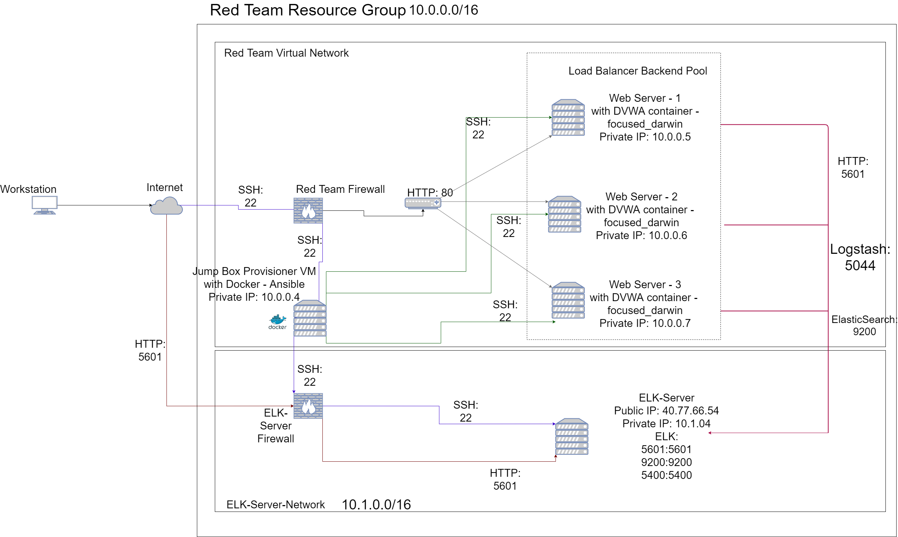
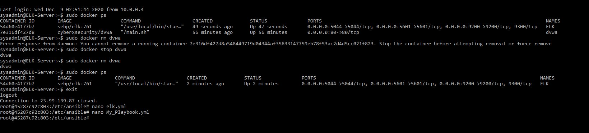

# Project1
##Cybersecurity Project 1 - Homework
## Automated ELK Stack Deployment

The files in this repository were used to configure the network depicted below.

https://drive.google.com/file/d/1WxC_Z52Ex4G6xkgJoxcIZDzBPU1z2DQ1/view?usp=sharing

These files have been tested and used to generate a live ELK deployment on Azure. They can be used to either recreate the entire deployment pictured above. Alternatively, select portions of the playbook file may be used to install only certain pieces of it, such as Filebeat.

  - _TODO: Enter the playbook file._
  - [Elk Playbook](Ansible/Elk.yml)
  - [Filebeat Playbook](Ansible/filebeat-playbook.yml)
  - [Metricbeat Playbook](Ansible/metricbeat-playbook.yml)

This document contains the following details:
- Description of the Topologu
- Access Policies
- ELK Configuration
  - Beats in Use
  - Machines Being Monitored
- How to Use the Ansible Build

### Description of the Topology

The main purpose of this network is to expose a load-balanced and monitored instance of DVWA, the D*mn Vulnerable Web Application.

Load balancing ensures that the application will be highly available, in addition to restricting unauthorized users to the network.
*TODO: What aspect of security do load balancers protect?
- Load Balancers protect against DDoS attacks.  Load Balancers receive incoming traffic to the website and distributes that traffic across multiple servers. In our virtual cloud setup with have one load balancer to distribute traffic between 3 Web Servers.

*What is the advantage of a jump box?_
A jump box has many advantages. For one, a jump box forces all traffic through a single node which makes it is to monitor and secure.  By logging into the jump box first we can manage a few connections and not have to necessarily monitor all of the virtual machines.  A jump box also protects our web servers from the public internet.  Only the jump box is exposed to the public internet (which we access through our virtual network using port 22).  A jump box also allows only specific IP addresses that it confirms and passes those to the machines.  

Integrating an ELK server allows users to easily monitor the vulnerable VMs for changes to the logs and system traffic.
- _TODO: What does Filebeat watch for?_
- Logging information - changes?????
- _TODO: What does Metricbeat record?_
-	Metricbeat records metrics and statistics - such as CPU usage or loads to a web server.

The configuration details of each machine may be found below.
_Note: Use the [Markdown Table Generator](http://www.tablesgenerator.com/markdown_tables) to add/remove values from the table_.

| Name     | Function                         | IP Address | Operating System |
|----------|----------------------------------|------------|------------------|
| Jump Box | Gateway                          | 10.0.0.1   | Linux            |
| Web 1    | Web Server                       | 10.0.0.5   | Linux            |
| Web 2    | Web Server                       | 10.0.0.6   | Linux            |
| Web 3    | Web Server                       | 10.0.0.7   | Linux            |
| Elk Sever| Centralized Logging and Storage  | 10.1.0.4   | Linux            |

### Access Policies

The machines on the internal network are not exposed to the public Internet. 

Only the Jump Box Provisioner machine can accept connections from the Internet. Access to this machine is only allowed from the following IP addresses:
- _TODO: Add whitelisted IP addresses_
- My home IP (undisclosed)

Machines within the network can only be accessed by the Jump Box Provisioner with the ansible docker running (in my case - docker focused_darwin).
- _TODO: Which machine did you allow to access your ELK VM? What was its IP address?_
- Jump Box Provisioner
- Private IP: 10.0.0.4

A summary of the access policies in place can be found in the table below.

| Name                 | Publicly Accessible | Allowed IP Addresses  |
|----------------------|---------------------|-----------------------|
| Jump-Box-Provisioner | Yes                 | Home IP (undisclosed) |
| Web-1                | No                  | 10.0.0.4              |
| Web-2                | No                  | 10.0.0.4              |
| Web-3                | No                  | 10.0.0.4              |
| Elk-Server           | No                  | 10.0.0.4              |

### Elk Configuration

Ansible was used to automate configuration of the ELK machine. No configuration was performed manually, which is advantageous because...
- _TODO: What is the main advantage of automating configuration with Ansible?_
- •	By configuring with Ansible we only need to run our playbook once and it will update all three web machines at the same time. Since Ansible is easy to use, this saves time and ensures consistency through all three machines.

The playbook implements the following tasks:
- _TODO: In 3-5 bullets, explain the steps of the ELK installation play. E.g., install Docker; download image; etc._
- Use more memory
- Install Docker
- Install Python3
- Install Python Docker
- Download and Launch an Elk Container
- Enable the service

The following screenshot displays the result of running `docker ps` after successfully configuring the ELK instance.

https://drive.google.com/file/d/1yUMUWmB5yqlOKO-EnmLLjqY0rz6cjI_W/view?usp=sharing

### Target Machines & Beats
This ELK server is configured to monitor the following machines:
- _TODO: List the IP addresses of the machines you are monitoring_
Private IP's:
- 10.0.0.5
- 10.0.0.6
- 10.0.0.7

We have installed the following Beats on these machines:
- _TODO: Specify which Beats you successfully installed_
- Filebeat
- Metricbeat

These Beats allow us to collect the following information from each machine:
- _TODO: In 1-2 sentences, explain what kind of data each beat collects, and provide 1 example of what you expect to see. E.g., `Winlogbeat` collects Windows logs, which we use to track user logon events, etc._
- Filebeat - Centralizes log data and forwards to the Elk Server. Filebeat monitors log files, collects log events, and will forward to Logstash or Elasticsearch.  An example is the system syslog.  If someone is attempting to log into one of my web servers but the firewall is in place properly, the attacker will not gain access and my Kibana log file will show the numerous attampts to try and log in.

- Metricbeat - collects metrics and statistics and sends them to a specific output such as ElasticSearch or Logstash.  For example, I ran a stress test on my web server 1.  I then viewed in Kibana - the metrics tab and how it recorded the data.  Specifically I saw how metricbeat monitored the CPU usage and how it was running much higher than normal.

### Using the Playbook
In order to use the playbook, you will need to have an Ansible control node already configured. Assuming you have such a control node provisioned: I do - the Jump-Box-Provisioner running an Ansible Container (focused_darwin)

SSH into the control node and follow the steps below:
- Copy the Elk playbook file to ansible docker.
- Update the hosts file to include... *Web Server IP addresses (with python interpreter) and ELK server IP address (with python interpreter)
- Run the playbook, and navigate to the webservers to check that the installation worked as expected.

_TODO: Answer the following questions to fill in the blanks:_
- _Which file is the playbook? Where do you copy it?_
- elk.yml -- copied in /etc/ansible/ folder of the ansible docker
- _Which file do you update to make Ansible run the playbook on a specific machine? How do I specify which machine to install the ELK server on versus which to install Filebeat on?_
- You will update the hosts file to include the web server IPs and the Elk server IP.

- _Which URL do you navigate to in order to check that the ELK server is running?
Kibana website - specifically - Elk-server-IP:5601/app/kibana ex: 104.43.202.171:5601/app/kibana
- As a **Bonus**, provide the specific commands the user will need to run to download the playbook, update the files, etc._
***
- In your In your Jump-Box and connected to your ansible container - navigate to your /etc/ansible folder
- Then create a folder for the files.  Create by doing: mkdir playbooks
- Next you will download the project from GitHub:
- git clone https://github.com/ejcasper/Elk-Stack-Project.git
- Now it is time to copy the playbook files into our new folder:
- cp /Elk-Stack-Project/Ansible/* .
- cp /Elk-Stack-Project/Ansible* ./playbooks
- Now update the hosts file with the IP of your Web Servers and Elk server.
- Then install your elk server by running: ansible-playbook elk.yml
 